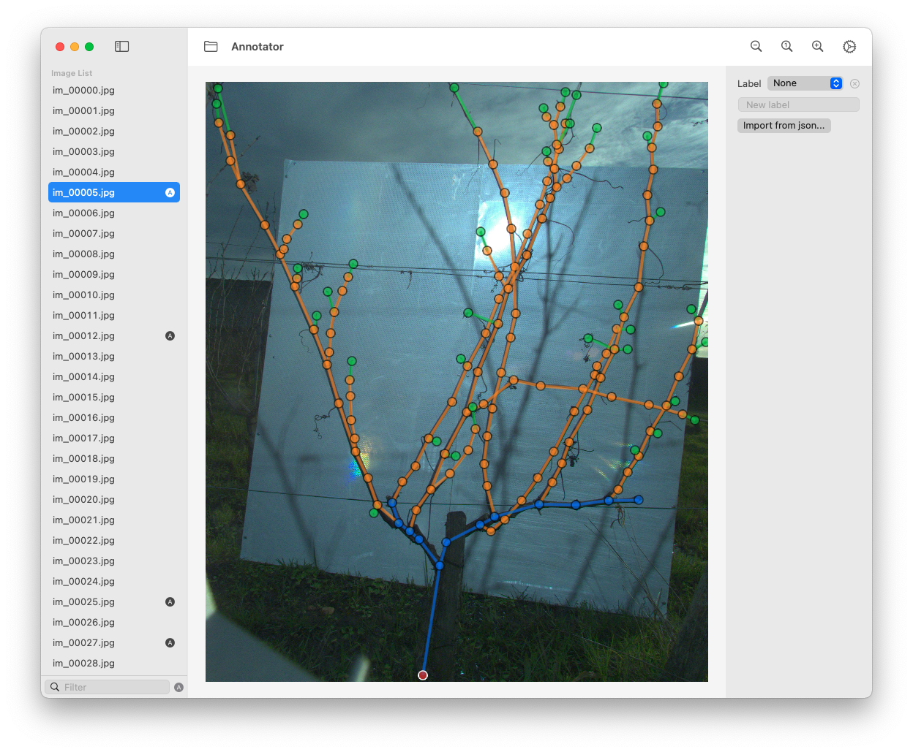

# Annotator
Annotate arborescent structures in images.

## Features
- Open a folder containing images with the folder button.
- Click an image to begin annotation.
- Filter the image list using the search bar at the bottom.
- Double click on the image to add node.
- Right click on a node to remove it.
- Click on a connection line to add a node between two nodes.
- Drag a node to move it.

The annotation is saved in JSON format next to the selected image. Example provided in [example.json](example.json).

Display settings can be tuned in the preferences pane (keypoint opacity and size).

## Contact
louis.lac@ims-bordeaux.fr
